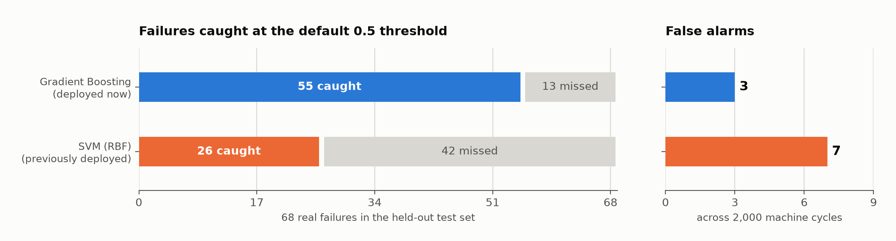

# Industrial Predictive Maintenance

**Predict machine failure from live sensor readings — and show, per prediction, exactly which sensor drove the call.**

[](https://www.python.org/)
[](https://streamlit.io/)
[](https://scikit-learn.org/)
[](https://shap.readthedocs.io/)
[](LICENSE)

An interactive Streamlit application over the **UCI AI4I 2020** dataset (10,000 machine cycles,
3.39% failure rate). It compares four classifiers, deploys the one that actually wins, explains
every prediction with SHAP, and decomposes failures into the five distinct modes the dataset
records.

---

## Headline result



At the default 0.5 threshold, on a held-out stratified test set containing **68 real failures**:

| | Failures caught | Failures missed | False alarms |
|---|---|---|---|
| **Gradient Boosting** (deployed) | **55 / 68 — 80.9%** | **13** | **3** |
| SVM (RBF) — previously deployed | 26 / 68 — 38.2% | 42 | 7 |

Catching 4 out of 5 failures while raising 3 false alarms across 2,000 machine cycles.

---

## Quickstart

```bash
git clone https://github.com/yashvi-26/predictive-maintenance-ml.git
cd predictive-maintenance-ml
pip install -r requirements.txt
streamlit run app.py
```

Opens at `http://localhost:8501`, and starts in about a second. The dataset is committed and the
trained models ship as a 0.1 MB artifact, so nothing is downloaded or fitted at startup.

To retrain from scratch after changing the pipeline:

```bash
python train.py      # ~45s, rewrites artifacts.joblib
```

The app works without the artifact too — it falls back to training on startup. No API keys, no setup.

---

## What's in it

| Tab | What it does |
|---|---|
| **Live Prediction** | Move sensor sliders, get a calibrated failure probability plus a per-prediction SHAP attribution showing which readings pushed it there |
| **Model Comparison** | All four models on one split — ROC, precision-recall, and calibration curves |
| **SHAP Explainability** | Global attribution, beeswarm distribution, and a dependence plot exposing the wear/torque interaction |
| **Failure Mode Analysis** | The 5 failure modes (TWF/HDF/PWF/OSF/RNF), their sensor signatures, and a co-occurrence matrix |
| **Feature Engineering** | Each engineered feature with its physical justification |

---

## Model selection

Four models, same stratified split, same scaler. The deployed model is whichever one won:

| Model | ROC-AUC | Avg Precision | Brier ↓ | CV ROC-AUC (5-fold) |
|---|---|---|---|---|
| Logistic Regression | 0.9403 | 0.4531 | 0.1036 | 0.9266 ± 0.0113 |
| Random Forest | 0.9698 | 0.8432 | 0.0102 | 0.9786 ± 0.0111 |
| **Gradient Boosting** | **0.9751** | **0.8980** | **0.0067** | **0.9819 ± 0.0124** |
| SVM (RBF) | 0.9659 | 0.6268 | 0.0192 | 0.9477 ± 0.0134 |

*Reproduced by `python train.py`; these are the exact values the app displays. Small drift
between scikit-learn versions is normal — regenerate the artifact and this table moves together.*

**Average Precision is the metric that decides this problem.** At a 3.39% failure rate, accuracy
is meaningless — a model that predicts "nominal" forever scores 96.6%. ROC-AUC is also
flattering here, because it is dominated by the vast nominal majority; every model above clears
0.94 on it while differing enormously in practice. Average Precision only rewards performance on
the rare positive class, and there the spread is real: **0.898 vs 0.627**.

Gradient Boosting also needs no calibration wrapper. Its Brier score (0.0067) is already ~3×
better than the SVM's (0.0192), and wrapping the SVM in isotonic regression moved it only to
0.0189 — so the wrapper was removed rather than kept for appearances. (The previously deployed
model was that calibrated SVM; it caught 29 of 68 failures, against the plain SVM's 26 and
Gradient Boosting's 55.)

> **This project used to deploy the SVM.** The comparison table above is why it no longer does.
> The original version chose the SVM up front and then presented a comparison table that
> contradicted the choice. Reading the table properly is what produced the result at the top of
> this README — a jump from 43% to 81% of failures caught. Running the comparison is not the
> same as acting on it.

### Threshold is a business decision, not a default

0.5 is a convention, not an answer. In maintenance, a missed failure (unplanned downtime) costs
far more than a false alarm (an unnecessary inspection). The deployed model's full trade-off:

| Threshold | Recall | Precision | Failures missed | False alarms |
|---|---|---|---|---|
| 0.50 | 0.809 | 0.948 | 13 | 3 |
| 0.30 | 0.824 | 0.949 | 12 | 3 |
| 0.10 | 0.838 | 0.803 | 11 | 14 |
| 0.05 | 0.853 | 0.611 | 10 | 37 |

Gradient Boosting is unusually stable here — dropping the threshold from 0.50 to 0.30 costs
nothing and catches one more failure. The SVM was not: to reach comparable recall (0.824) it
needed a 0.10 threshold, and produced **116** false alarms against Gradient Boosting's 3.

---

## Feature engineering

Five features derived from the five raw sensors, each grounded in a physical failure mechanism
rather than arbitrary arithmetic:

| Feature | Definition | Physical reasoning | Failure mode |
|---|---|---|---|
| `Temp_Diff` | `Process_Temp − Air_Temp` | Cooling margin. A narrowing gap means heat is not being shed. | HDF |
| `Power` | `τ × (rpm · 2π/60)` | True mechanical power in watts. Sustained overload degrades insulation. | PWF |
| `Wear_Strain` | `Tool_Wear × Torque` | A worn tool under load sees amplified stress at the cutting edge. | TWF, OSF |
| `Speed_Torque_Ratio` | `rpm / τ` | Operating-point stability. Low speed with high torque is the stall regime. | OSF |
| `Thermal_Stress` | `Temp_Diff × Power / 10⁶` | Compound: running hot *and* working hard simultaneously. | HDF + PWF |

Measured correlation with `Machine_Failure` — two engineered features rank in the top three:

| Feature | \|Pearson r\| |
|---|---|
| Torque | 0.191 |
| **Wear_Strain** *(engineered)* | 0.190 |
| **Power** *(engineered)* | 0.176 |
| **Temp_Diff** *(engineered)* | 0.112 |
| Tool_Wear | 0.105 |

`Power` is a genuine improvement over its own inputs — it correlates more strongly with failure
(0.176) than `Rot_Speed` does alone (0.044).

---

## Explainability

SHAP runs on the **deployed model**, using scaled inputs — the same representation the model was
fitted on. Both of those are deliberate:

- Explaining a different model than the one serving predictions produces attributions that
  describe something the user never saw.
- Feeding raw values to a model trained on standardised ones produces attributions for points
  far outside the training distribution. Tree models don't error on this — they silently return
  numbers that look plausible and mean nothing.

Both were mistakes in an earlier version of this app, and both are fixed. Gradient Boosting is
tree-based, so `TreeExplainer` computes SHAP values exactly, with no sampling approximation.

---

## Dataset

**UCI AI4I 2020 Predictive Maintenance Dataset** — 10,000 rows, synthetic but modelled on real
milling-machine behaviour.

- **339 failures (3.39%)** — realistic industrial class imbalance
- **Five failure modes:** HDF (115), OSF (98), PWF (95), TWF (46), RNF (19)
- Downloaded at runtime from the UCI ML Repository and cached by Streamlit

RNF is *random* failure — noise with no sensor signature by construction. It is included in the
failure-mode analysis because pretending it is predictable would be dishonest about the ceiling
on this problem.

---

## Limitations

Worth stating plainly:

- **The data is synthetic.** Real sensor streams carry drift, dropouts, and miscalibration that
  this dataset does not simulate. Numbers here are an upper bound.
- **Each row is an independent snapshot,** not a time series. Real predictive maintenance uses
  sensor *trajectories*; degradation is a trend, not a reading. A sequence model over real
  telemetry is the honest next step.
- **RNF is unpredictable by construction** — roughly 5.6% of failures have no signal at all.
- **No hyperparameter search.** Models use near-default settings. Tuning would likely narrow the
  gap between Gradient Boosting and Random Forest, though not the gap to the SVM.
- **Single train/test split** for the headline numbers, with 5-fold CV reported alongside as a
  stability check.

---

## Repository structure

```
predictive-maintenance-ml/
├── app.py             # Streamlit UI — the five tabs
├── app_core.py        # data loading, feature engineering, the split
├── train.py           # offline training → artifacts.joblib
├── artifacts.joblib   # trained model + metrics + SHAP values (~0.1 MB)
├── data/
│   └── ai4i2020.csv   # committed so the live demo has no runtime dependency
├── requirements.txt
├── LICENSE
└── README.md
```

**Why `app_core.py` exists.** Feature engineering is imported by both `app.py` and `train.py`
rather than written twice. If the two had their own copies, one could be edited without the
other and the app would score live input the model was never fitted on — train/serve skew, and
a silent failure: no error, just quietly wrong predictions. For the same reason, the live
sensor sliders in Tab 1 are routed through the same `engineer_features()` call the training
rows went through, instead of restating the formulas in the UI.

### Startup cost

Measured, model-ready time excluding Python's library imports (~5s, paid once per process):

| | |
|---|---|
| Training on launch | **~43s** — 5.7s download + 37s fitting and cross-validation |
| Loading `artifacts.joblib` | **0.11s** — 0.09s CSV and features, 0.00s artifact, 0.02s TreeExplainer |

Worth doing because Streamlit's free tier puts an app to sleep after inactivity — without the
artifact, every visitor arriving after a quiet period would wait out a full retrain.

## License

MIT — see [LICENSE](LICENSE).
